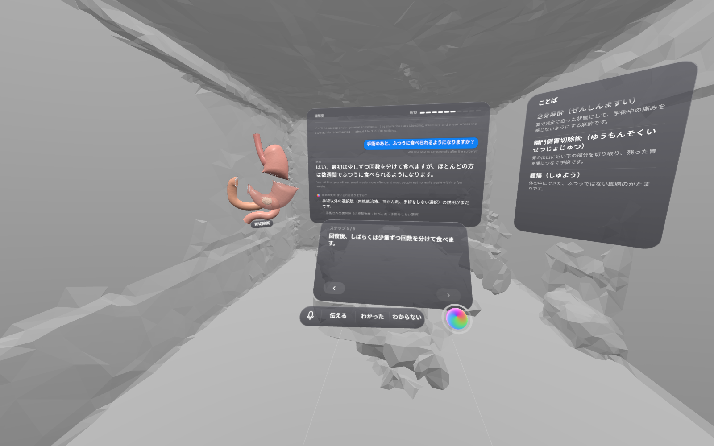
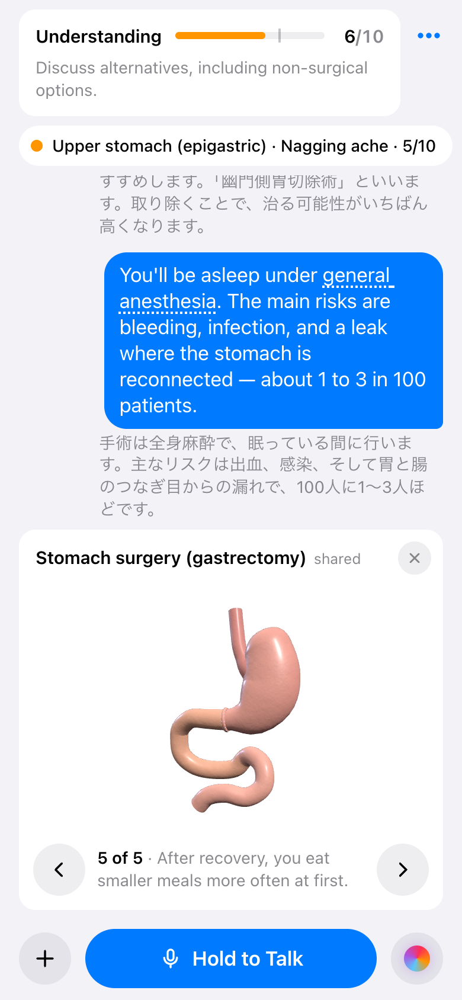
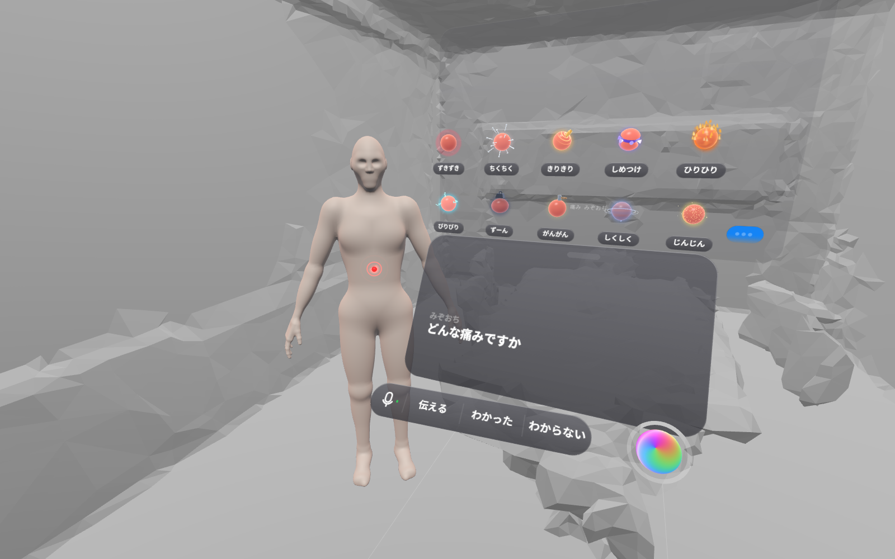
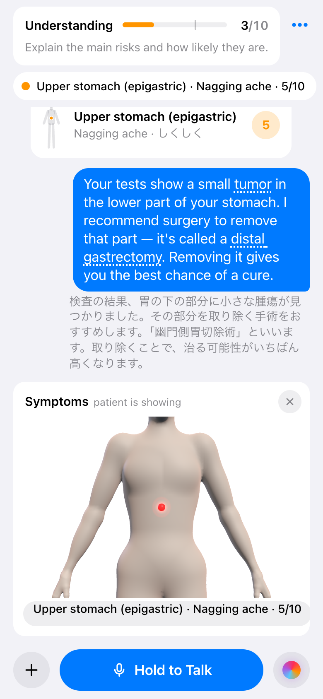
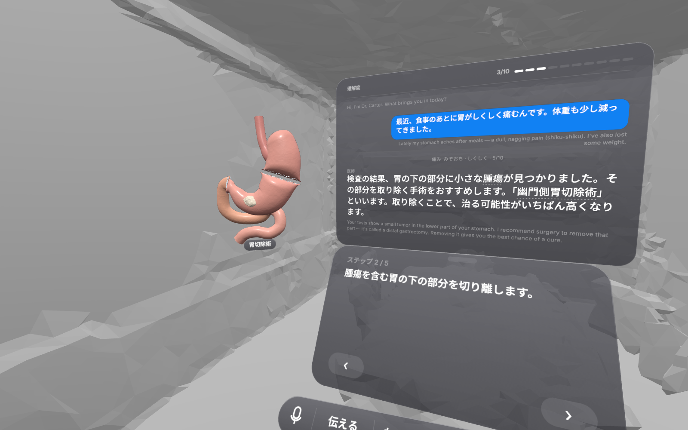
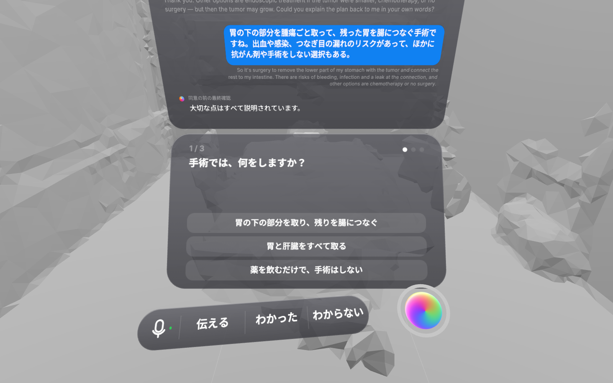
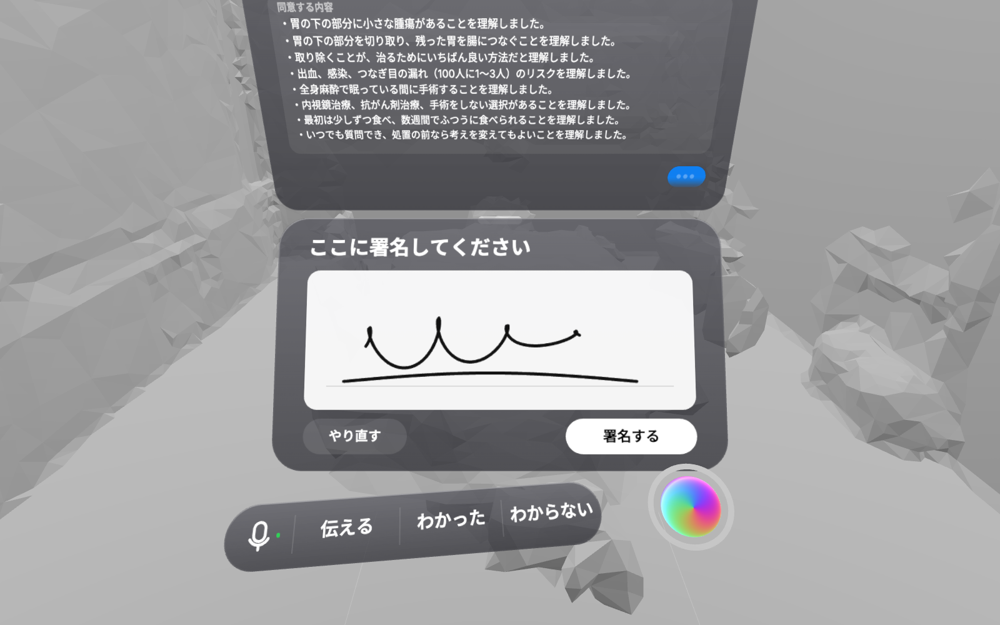

# EyeSee

**See what your doctor means. See what your patient understands.**

So that a doctor and a patient can both say "I see."

医師と患者が、お互いに「I see」と言えるように。

EyeSee is a shared understanding interface for a doctor and a patient. It works across 12 languages,
and also within one language, where accents and medical jargon get in the way just as much.
The doctor uses a laptop or phone, the patient wears a Meta Quest, and both see one live record of the
visit, each in their own language.

<p align="center">
  
  
</p>
<p align="center"><sub>Left: what the patient sees in the headset. Right: the doctor's phone at the same moment.
The demo patient speaks Japanese; the other languages work the same way.<br>
Screenshots of the running app on an emulated Meta Quest 3, inside a scanned meeting room (<a href="tests/readme-shots.mjs"><code>tests/readme-shots.mjs</code></a>).</sub></p>

## Why we built this

We started from one question: how do you prevent the communication failures that grow out of asymmetry,
in language (native English speakers and everyone else), in expertise, and in culture?

**Our own experience.** Two of the three people on our team have been patients in hospitals in the
United States and could not really communicate with their doctors. Things they could say naturally in
Japanese did not carry over into English at all: for example the sound words Japanese speakers use
for pain, such as *chiku-chiku* (a prickling, needle-like pain) or *zuki-zuki* (a throbbing pain).
Their English was not enough, and they had no medical knowledge to fill the gaps.

That is why, in EyeSee, the patient never has to translate a sensation. They point at a life-size body
and pick what they feel from animated orbs named with those same sound words.

**The doctor's side.** On September 26, 2026 we interviewed two medical students at the University of
Tokyo Faculty of Medicine, separately: one in their 5th year and one in their 6th year, both with
clinical clerkship experience in hospitals. Both told us that the most important communication
challenges in medicine are in the medical interview, tests, explanations and informed consent. For a
doctor in particular, a failure there brings the risk of a lawsuit and can put a career on the line.

A misunderstanding in these moments hurts both people in the room: the patient makes a decision they
did not understand, and the doctor carries the risk. That is why EyeSee starts with informed consent.

## Vision

**Start with informed consent: the highest-stakes decision in medicine.**

EyeSee is not a VR app for hospitals. It is a *Shared Understanding Interface* that can be carried into other fields.

The problem it targets has one shape: A explains, B understands something different, a serious decision
is made anyway, and a dispute follows. Informed consent is where this matters most. It is the last step
before an irreversible decision, it carries the widest information gap between the two people in the
room, and it is where legal disputes begin. If shared understanding works there, the same interface
extends to law, insurance, immigration procedures, renting a home and financial contracts: anywhere it
matters that people truly understand before they press "Yes".

### Information made physical, in both directions

- **The patient holds the information about the illness**: where it hurts and what it feels like. That is what VR should make physical. The patient points at a life-size body and picks the sensation they feel from animated orbs, so "it hurts here, like this, this much" lands on the body itself where the doctor can see it.
- **The doctor holds the information about the decision.** The patient must truly understand it mainly at informed consent. For everything else, such as how to take a medication, a faithful translation plus the key points is enough.

### Who it is for

- Doctors who worry that a gap in communication will turn into a lawsuit, and patients who can't follow medical English.
- The patient speaks in whatever language is easiest for them, even with a strong accent. The doctor can see, in real time, which parts the patient did and didn't understand.

### Why medicine first

- [CRICO/Candello (2025)](https://www.candello.com/About/Press-Release-and-News/2025-Benchmarking-Report-Press-Release) analysed U.S. medical professional liability data from 2014–2024, covering about a third of open and closed claims. 40% of asserted malpractice cases involved a communication-related factor, and 63% of those involved a provider–patient communication failure.
- In [another study of 498 claims](https://doi.org/10.1097/PTS.0000000000000937) (Humphrey et al., *Journal of Patient Safety*, 2022), 49% involved a communication failure. Those cases cost about $237,600 on average, against about $154,100 without one.
- Across [21,101 closed claims](https://doi.org/10.2147/RMHP.S403710) (*Risk Management and Healthcare Policy*, 2023), the main drivers of patient/family–provider communication problems were expectation communication, inadequate informed consent and poor rapport.
- In [9,500+ surgical malpractice cases](https://www.rmf.harvard.edu/News-and-Blog/In-the-News-Home/In-the-News/2024/July/How-Informed-Consent-Impacts-Surgery-Malpractice-Outcomes) (CRICO/Candello, closed 2017–2021), inadequate informed consent made an indemnity payment more likely. Not explaining non-surgical alternatives was a specific risk factor.

That last finding is why EyeSee's understanding score cannot reach 7/10 until alternatives have been discussed. The demo shows the doctor asking the AI "Did I forget anything?" and the AI catching that gap.

## What EyeSee does

### Talking
- **Doctor (laptop / phone):** hold the **Hold to Talk** button, or hold **Space** on a keyboard. Nothing is recorded unless the button is held, so conversations in the room are never written down by accident. Continuous listening is an opt-in setting.
- **Patient (headset):** just talk, in whatever language and accent is easiest. The headset microphone hears only its wearer.
- **One shared conversation.** Each side reads everything in their own language, with what was actually said in small type underneath. Live indicators show who is speaking and what is being translated.
- **Read aloud in the headset** (on by default): the doctor's words are also spoken to the patient in their language. The headset microphone pauses while it speaks.
- **Plain explanations** and, for Japanese, **Hiragana**: the patient reads a school-textbook-level version (or mostly-kana, phrase-spaced text). The literal translation stays small underneath. On the doctor's screen, your own words shrink and what the patient actually reads is shown larger.
- **Nuance for the doctor**: when the patient's words carry a meaning a literal translation would lose, a short note explains it. For example, the sound word *zuki-zuki* becomes "throbbing (zuki-zuki)". A note appears only for a concrete false guarantee ("100% safe"); encouragement and reassurance are never flagged.

### The patient shows their symptoms (information made physical)
- The patient presses **Show** in the headset, or the doctor opens **Symptoms**.
- The patient points at a life-size body, picks what it feels like from 10 animated sensations (throbbing, prickling, squeezing, a nagging ache…, named with the sound words patients use, such as *zuki-zuki* or *shiku-shiku*), then picks the strength from 0 to 10.
- The sensation stays on the body where they pointed.
- The doctor sees it all:
  - a chip per spot under the understanding bar;
  - a card in the conversation with a small body map;
  - a 3D symptom map that opens with one tap.
- The patient can also say how they feel: rushed, needs time to think, wants to ask family, and so on.

<p align="center">
  
  
</p>

### Explaining (the doctor's information)
- **Glossary:** medical terms the doctor used are explained in plain words in the patient's language, and underlined in the text.
- **Illustrations:** press **Show picture** and a picture opens large in front of the patient. The AI first designs one clear, anatomically sensible subject; the image has no text, and the caption is drawn in the patient's language. Tap the picture, or wait 30 s, and it flies back to where it came from.
- **3D, shared:** the doctor rotates the model, pinches to zoom and taps parts, and the headset mirrors it live. The library:
  - a heart with a stenosis;
  - lungs;
  - step-by-step procedures: coronary stent (PCI), liver resection, gastrectomy.
- **I see / I don't understand:** the patient marks any line they did or didn't understand. After "I don't understand", the doctor gets a simpler way to say it and the patient gets a plain explanation.

<p align="center">
  
</p>

### EyeSee AI
- Hold the **AI orb** (headset) or the AI button (doctor) and ask anything. Both sides see the question and the answer.
- What is said to the AI stays in the conversation as that person's own words.
- It searches the web for current medical facts and shows its sources.
- It checks what's missing ("Did I forget anything?"), shows 3D models, draws illustrations, and can switch the patient's language on request.

### Understanding and consent
1. **Understanding bar, always on.** JEV scores shared understanding 0–10 after every utterance, from the start of the visit. The next thing to explain is shown under the bar.
2. **At 7/10 the doctor can open consent.** The AI reads the whole conversation and posts a final check for omissions into the chat, for both sides.
3. **Comprehension check.** The AI writes 3 questions from the conversation (what will be done, the main risks, the other options). The patient must answer all 3 correctly in the headset. A wrong answer shows the explanation, alerts the doctor, and can be retried.
4. **Agreement and signatures.** What the patient is agreeing to appears in the conversation, then the patient signs in the air with a finger and the doctor signs on the laptop or phone.
5. **The record.** A printable record of the visit (`/record/<room>`) holds the minutes, the understanding trajectory, the AI final check, the quiz answers, the agreement, both signatures and a SHA-256 of the whole record.

<p align="center">
  
  
</p>

### Languages
- **12 languages:** English, Japanese, Spanish, Chinese, Korean, Vietnamese, Portuguese, Tagalog, Arabic, Hindi, Russian and French.
- **Headset (patient)** and **Console (doctor)** languages are set separately in ⋯, and any pair works, including the same language on both sides.
- If the patient starts speaking another language, the headset switches to it automatically. The patient can also ask the AI to switch.
- The headset's interface is in the patient's language too. Japanese and English are written by hand; other languages are translated once by the AI and cached.

## The two-minute demo

On the doctor's screen, open **⋯ → Play Demo**. One tap plays the conversation, paced for an audience, in about 1:30–1:50. Then the demo hands over to the people in the room:

1. The patient: "My stomach has a nagging ache after meals." The nagging-ache sensation lands on the upper stomach of the body.
2. The doctor finds a small tumor in the lower stomach and recommends a distal gastrectomy. The stomach model shows each step: tumor, cutting, removal, reconnection.
3. The doctor explains anesthesia and the risks. The patient asks "Will I be able to eat normally?", and the model shows eating after recovery.
4. The doctor asks the AI "Did I forget anything?", and the AI points out the missing alternatives. **The understanding score is held at 6 until this point.**
5. The doctor explains the alternatives and asks the patient to explain the plan back. The score passes 7.
6. Consent: the final check appears in the chat. Then **the patient answers the three questions in the headset**. Each correct answer is marked, and all three correct shows an "all correct" screen. **Both sign by hand**: the patient in the headset, the doctor on the console. The demo never answers or signs for anyone. It ends only when the consent is signed.

Each of the doctor's lines waits until the headset has finished reading it aloud. The translations are prepared in advance and the audio is cached, so the demo runs the same way every time; set `EYESEE_DEMO_LIVE=1` to send the lines through the live AI instead. **Next Step** in the same menu steps through by hand.

## How the understanding score works

After every utterance, [JEV](https://docs.typesafe.ai) (TypeSafe AI's System One model) answers typed questions about the conversation, in about 100 ms per call:
- **score:** a 10-level rubric, from "nothing explained, even if the patient says yes" to "exemplary".
- **noul** (probability yes/no), one per consent element: diagnosis, procedure, benefits, risks, alternatives, option to decline, anesthesia, recovery, invitation to ask questions.
- **choice**, for the patient's understanding: none / *claimed* (only "yes") / partial / demonstrated (they explained it back).

The server then applies caps, so a bare "I agree" can never unlock consent:

| Held at | When |
|---|---|
| 0 | Nothing explained yet |
| 3 | The procedure or its risks haven't come up |
| 5 | The procedure or risks aren't clearly explained, or the patient has shown no understanding |
| 6 | A core element (e.g. **alternatives**) hasn't been discussed, or an "I don't understand" or worry is still open |
| 7 | A core element was only mentioned briefly |
| 8 | The patient hasn't explained it back yet |

Consent unlocks at **7**. Without JEV, a language model or an offline keyword heuristic produces the same kind of assessment, and the same caps apply.

## Quick start

```bash
npm install
cp .env.example .env        # add keys (optional: without keys EyeSee runs its offline demo)
npm start
```

The server prints its addresses and which AI is active:
```
EyeSee http  → http://localhost:8080
EyeSee https → https://localhost:8443
   on Wi-Fi:   https://192.168.x.x:8443
AI: language=gemini · speech=gemini · images=gemini · understanding judge=jev
```

**Doctor:** open `http://localhost:8080/d` on the laptop running the server, or `https://<LAN-IP>:8443/d` on a phone. The phone shows a certificate warning once; accept it.

**Patient (Meta Quest), either:**
- **USB (recommended):** enable developer mode, connect the cable, run `adb reverse tcp:8080 tcp:8080`, and open `http://localhost:8080/q` in the Quest browser. There's no certificate warning this way.
- **Wi-Fi:** open `https://<LAN-IP>:8443/q` and accept the certificate once. Some venue networks block device-to-device traffic; a phone hotspot works around it.

Then press **Start** and **Start** again to enter passthrough AR. The doctor's screen shows "Headset not connected" until the Quest joins.

Other details:
- **Several rooms:** add `?room=er-3` to both URLs.
- **Headset preview on a desktop:** `http://localhost:8080/quest?preview` (drag to look around, click, hold Space to ask the AI, type as the patient).

### Controls

| | Headset | Doctor |
|---|---|---|
| Talk | Just speak | Hold **Hold to Talk** or **Space** |
| Ask AI | Hold the AI orb | Hold the AI button (tap it for suggestions) |
| Select / press | Poke with a finger, or pinch / trigger with the ray | Click / tap |
| Scroll | Pinch and drag, or the thumbstick | Scroll |
| 3D | Touch a part to name it | Drag to rotate, pinch or wheel to zoom, tap a part |
| Recenter | Squeeze a controller grip, or tap the bar under the conversation | — |

## AI stack

| Job | Default | Also supported |
|---|---|---|
| Speech → transcript + translation + glossary + notes (one call per utterance) | Gemini on Vertex AI (`gemini-3.6-flash`, audio in) | OpenAI speech-to-text + a text model |
| Consent package, final check, quiz, EyeSee AI (with Google Search grounding) | Gemini | **Claude** (`claude-opus-5`) if `ANTHROPIC_API_KEY` is set; OpenAI |
| Understanding score | **JEV** (`api.typesafe.ai/v1/systemone`) | LLM judge, offline heuristic |
| Illustrations | `gemini-2.5-flash-image`, art-directed by the language model | OpenAI images |
| Read-aloud voice | `gemini-2.5-flash-tts` (cached) | The headset browser's own voice |

Cost guards: 12 images per visit and 60 paid AI calls per minute (both configurable). Secrets live in `.env` and `secrets/`, both gitignored.

## Architecture

```
 Doctor · laptop / phone                 Node server                             Patient · Quest (WebXR)
 ───────────────────────                 ─────────────────────                   ───────────────────────
 hold-to-talk → WAV ──POST /api/rooms/:r/audio──▶ Gemini: hear + translate ─┐   ◀── mic (VAD) → WAV
 taps, 3D view, settings ──── WebSocket /ws ──▶ room state = the minutes ────┼──▶ glass windows, 3D, orbs
 ◀────────────────── full state (40 ms throttle) + events ──────────────────┘     (poke / pinch / ray)
                                          ├─ JEV score after every utterance
                                          ├─ /api/tts (read-aloud) · /api/i18n/:lang (interface text)
                                          └─ data/sessions/<id>.json · /record/:room
```

- `server/`
  - `index.js`: HTTP/HTTPS/WebSocket.
  - `pipeline.js`: speech → minutes → judge → symptoms → consent → demo.
  - `ai/`: Gemini, Claude, OpenAI, the JEV judge, prompts, TTS, offline fallbacks.
  - `i18n.js`, `record.js`, `demo/script.js`.
- `public/phone/`: the doctor's app (iOS-style).
- `public/quest/`: the patient's WebXR app (visionOS-style). It includes a texture-window scroll view for smooth pinch scrolling, and hand occlusion so real hands appear in front of the panels.
- `public/shared/`: catalogs, the recorder (voice detection plus push-to-talk), the symptom layer, and the procedural **3D models** (`models/heart.js`, `lungs.js`, `artery.js`, `liver.js`, `stomach.js`, `body.js`, `painviz.js`).

## Tests

```bash
node tests/flow.mjs        http://localhost:8080   # whole visit over the protocol: score gate, final check, quiz, signatures, record
node tests/xr.mjs          http://localhost:8080   # emulated Quest 3 (Meta IWER): AR, recenter, finger pokes, rays, pinch scrolling, body pointing
node tests/demo-timing.mjs http://localhost:8080   # plays the demo as a presenter would and times it
node tests/readme-shots.mjs http://localhost:8080  # the README screenshots (docs/img): plays the demo in an emulated Quest 3 inside a scanned room
```
To test without spending credits, start a second server with the AI switched off:
```bash
GOOGLE_APPLICATION_CREDENTIALS= JEV_API_KEY= PORT=8090 EYESEE_HTTPS=0 npm start
```

## Notes

- This is a hackathon prototype on a local network. There is no authentication, and the minutes are stored as plain JSON in `data/`. Real patient data would need HIPAA-grade hosting, access control, BAAs with the AI vendors, and a qualified medical interpreter policy.
- EyeSee supports the conversation; it does not replace the clinician's judgment.
